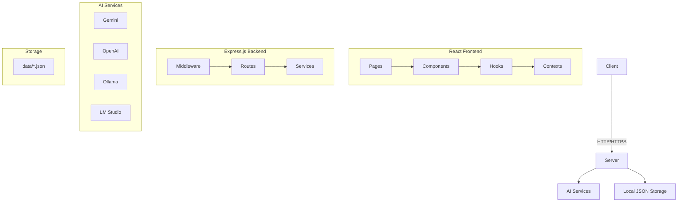

# System Architecture

## Overview

Modern full-stack TypeScript application built on **Feature-Driven Development (FDD)** architecture. Each feature is self-contained with its own components, services, types, and routes for maximum maintainability and scalability.

**Key Principles:**
- 🏗️ **Feature-First**: Every feature is a complete, independent module
- 🔄 **Consistent Structure**: Standardized organization across all features
- 🚀 **Easy Extension**: Adding new features follows a clear pattern
- 📦 **Local Storage**: JSON files by default, PostgreSQL optional

## High-Level Architecture



## Feature-Driven Development Structure

### Core Concept
Each feature contains everything it needs to function independently:

```
feature-name/
├── routes/          # API endpoints
├── services/        # Business logic
├── types/           # TypeScript definitions
├── components/      # UI components (client)
├── hooks/           # React hooks (client)
└── api/             # API client code (client)
```

### Current Project Structure

```
saas-ai-chatbot/
├── server/features/              # Server-side features
│   ├── auth/                    # Authentication & RBAC
│   │   ├── routes/
│   │   ├── services/
│   │   ├── types/
│   │   └── middleware/
│   ├── chatbot/                 # AI Chat functionality
│   ├── model-management/        # AI provider management
│   ├── translation/             # Translation services
│   ├── prompt-improver/         # Prompt enhancement
│   ├── user-management/         # User CRUD operations
│   └── templates/               # Template management
│
├── client/src/features/          # Client-side features
│   ├── auth/                    # Auth components & guards
│   │   ├── components/
│   │   ├── hooks/
│   │   ├── api/
│   │   └── types/
│   ├── chatbot/                 # Chat interface
│   ├── dashboard/               # Analytics & overview
│   ├── model-management/        # Model configuration UI
│   ├── settings/                # User preferences
│   └── ai-tools/                # AI utility tools
│
├── shared/                      # Cross-platform code
│   ├── types/                   # Shared TypeScript types
│   ├── validation.ts            # Zod schemas
│   └── schema.ts                # Database schemas
│
└── client/src/components/ui/    # Shared UI components
    ├── button.tsx
    ├── dialog.tsx
    └── ...
```

## Technology Stack

### Frontend Architecture
- **React 18.3.1**: Modern React with concurrent features, Suspense, and automatic batching
- **TypeScript 5.6.3**: Strict type safety with `noUncheckedIndexedAccess` and `exactOptionalPropertyTypes`
- **State Management**: TanStack Query v5 for server state + React Context for client state
- **UI Framework**: Radix UI primitives + Tailwind CSS 3.4.17 with CSS variables
- **Routing**: Wouter (lightweight, feature-friendly routing)
- **Forms**: React Hook Form + Zod validation for type-safe forms
- **Animations**: Framer Motion for smooth interactions
- **Build Tool**: Vite 5.4+ with optimized code splitting and tree shaking
- **Performance**: React.memo, useMemo, useCallback for optimization
- **Accessibility**: WCAG 2.1 AA compliance with Radix UI primitives

### Backend Architecture
- **Express.js**: RESTful API with TypeScript
- **Feature Registration**: Automatic route discovery
- **Authentication**: Session-based with CSRF protection
- **Validation**: Zod schemas across all features
- **Logging**: Winston with structured logging
- **Storage**: JSON files (default) + optional PostgreSQL

### AI Integration & Best Practices

#### **Multi-Provider Architecture**
- **Local Providers**: Ollama, LM Studio (privacy-first, no API keys)
- **Cloud Providers**: Google AI Studio, OpenAI, Anthropic, Mistral
- **Unified Interface**: Consistent API across all providers
- **Health Monitoring**: Real-time provider status and latency tracking
- **Model Management**: Dynamic model discovery and testing

#### **AI Development Best Practices**
```typescript
// 1. Proper error handling for AI operations
const useAIChat = () => useMutation({
  mutationFn: async (message: string) => {
    const controller = new AbortController();
    const timeoutId = setTimeout(() => controller.abort(), 30000);
    
    try {
      return await aiService.chat(message, { signal: controller.signal });
    } finally {
      clearTimeout(timeoutId);
    }
  },
  retry: (failureCount, error) => {
    // Don't retry on user cancellation or rate limits
    if (error.name === 'AbortError' || error.status === 429) return false;
    return failureCount < 2;
  }
});

// 2. Streaming responses with proper cleanup
const useStreamingChat = () => {
  const [response, setResponse] = useState('');
  
  const streamChat = useCallback(async (message: string) => {
    const stream = await aiService.streamChat(message);
    const reader = stream.getReader();
    
    try {
      while (true) {
        const { done, value } = await reader.read();
        if (done) break;
        setResponse(prev => prev + value);
      }
    } finally {
      reader.releaseLock();
    }
  }, []);
  
  return { response, streamChat };
};
```

#### **AI Security & Privacy**
- **Data Privacy**: Local processing options with Ollama/LM Studio
- **API Key Security**: Environment-based configuration, never client-side
- **Rate Limiting**: Provider-specific limits and graceful degradation
- **Content Filtering**: Input/output sanitization for AI responses
- **Audit Logging**: All AI interactions logged for compliance

## Feature-Driven Data Flow

### 1. Feature Request Lifecycle
```
Client Feature → API Hook → Server Feature → Service → Response
     ↓              ↓           ↓            ↓         ↓
  Component    TanStack    Feature Route  Business   JSON/DB
              Query                      Logic
```

### 2. Authentication Flow
- **Session Management**: HTTP-only cookies with CSRF tokens
- **Feature Guards**: Route-level authentication checks
- **RBAC**: Role-based access control per feature
- **Rate Limiting**: Feature-specific request throttling

### 3. AI Processing Flow
```
Chat Component → Chat API Hook → Chat Routes → Model Service → AI Provider
      ↓              ↓              ↓            ↓            ↓
  User Input    Request Queue   Validation   Provider     Response
                                            Selection    Streaming
```

### 4. State Management Strategy
- **Server State**: TanStack Query with feature-based cache keys
- **Client State**: React Context for UI state
- **Persistent State**: Local storage for user preferences
- **Real-time**: WebSocket integration for live features

## Performance

- **Frontend**: Code splitting, lazy loading
- **Backend**: Request validation, rate limiting
- **Caching**: React Query cache, CDN for static assets

## Security

- HTTPS enforced
- CSRF protection
- Input validation
- Secure session handling
- Environment-based configuration

### Feature Integration Pattern

```
┌─────────────────────────────────────────────────────────────┐
│                    Feature Request Flow                     │
└─────────────────────────────────────────────────────────────┘

1. Client Feature Component
   ├── Uses feature-specific API hook
   ├── Handles loading/error states
   └── Manages local UI state

2. API Hook (TanStack Query)
   ├── Caches responses with feature key
   ├── Handles request/response transformation
   └── Provides optimistic updates

3. Server Feature Route
   ├── Validates request with Zod schema
   ├── Applies authentication middleware
   ├── Enforces CSRF protection
   └── Calls feature service

4. Feature Service
   ├── Implements business logic
   ├── Interacts with storage/external APIs
   ├── Handles error cases
   └── Returns typed response

5. Storage Layer
   ├── JSON files (default)
   ├── Optional PostgreSQL
   └── Consistent data access patterns
```

## Security Architecture

### Feature-Level Security

Each feature implements consistent security patterns:

```typescript
// Feature Route Security Pattern
router.post('/feature-endpoint',
  requireAuth,           // Authentication check
  csrfProtection,       // CSRF token validation
  rateLimiter,          // Request rate limiting
  validateBody(schema), // Input validation
  featureController     // Business logic
);
```

### Security Layers

1. **Transport Security**
   - HTTPS enforcement with HSTS headers
   - TLS 1.3 minimum in production
   - Secure cookie configuration with SameSite=Strict
   - Content Security Policy (CSP) headers

2. **Authentication & Session Management**
   - Session-based auth with HTTP-only, secure cookies
   - Automatic session rotation and expiration
   - Secure session storage with encryption
   - Multi-factor authentication ready

3. **Authorization**
   - Role-based access control (RBAC) with principle of least privilege
   - Feature-level permissions with granular controls
   - Route-level guards with proper error handling
   - API endpoint authorization middleware

4. **Input Validation & Sanitization**
   - Zod schema validation on all inputs (client + server)
   - Type-safe request/response handling
   - SQL injection prevention with parameterized queries
   - XSS protection with output encoding
   - File upload validation and sanitization

5. **CSRF Protection**
   - Double-submit cookie pattern
   - Token validation on all state-changing operations
   - SameSite cookie attributes
   - Origin header validation

6. **Rate Limiting & DDoS Protection**
   - Feature-specific rate limits
   - IP-based throttling with sliding window
   - Request size limits
   - Slow loris attack protection

7. **Modern Security Headers**
   ```typescript
   // Security headers automatically applied
   'Content-Security-Policy': "default-src 'self'; script-src 'self' 'unsafe-inline'",
   'X-Content-Type-Options': 'nosniff',
   'X-Frame-Options': 'DENY',
   'X-XSS-Protection': '1; mode=block',
   'Referrer-Policy': 'strict-origin-when-cross-origin',
   'Permissions-Policy': 'camera=(), microphone=(), geolocation=()'
   ```

### Security Layers

1. **Transport Security**: HTTPS enforcement
2. **Session Security**: Secure cookie configuration
3. **CSRF Protection**: Token-based validation
4. **Rate Limiting**: Request throttling
5. **Input Validation**: Zod schema validation
6. **Error Handling**: Sanitized error responses

## Storage Architecture

### Feature-Based Data Organization

Each feature manages its own data with consistent patterns:

```
data/
├── auth/
│   ├── users.json           # User accounts
│   └── sessions.json        # Active sessions
├── chat/
│   ├── conversations.json   # Chat history
│   └── messages.json        # Message data
├── templates/
│   └── user_templates.json  # Saved templates
└── settings/
    └── user_preferences.json # User settings
```

### Storage Service Pattern

```typescript
// Feature Storage Service
class FeatureStorageService {
  private dataPath = 'data/feature-name/'
  
  async create(data: FeatureType): Promise<FeatureType>
  async read(id: string): Promise<FeatureType | null>
  async update(id: string, data: Partial<FeatureType>): Promise<FeatureType>
  async delete(id: string): Promise<boolean>
  async list(filters?: FilterType): Promise<FeatureType[]>
}
```

### Optional PostgreSQL Migration

For scaling, features can migrate to PostgreSQL while maintaining the same service interface:

```typescript
// Same interface, different implementation
class FeaturePostgreSQLService implements FeatureStorageService {
  // Database implementation using Drizzle ORM
}
```

## Deployment Architecture

### Development Environment

```
┌─────────────────┐    ┌─────────────────┐
│   Vite Dev      │    │  Express Dev    │
│   Server        │    │   Server        │
│                 │    │                 │
│ • Hot reload    │    │ • Nodemon       │
│ • Port 5173     │    │ • Port 5000     │
│ • Proxy to API  │    │ • CORS enabled  │
└─────────────────┘    └─────────────────┘
```

### Production Environment

```
┌─────────────────┐
│   Reverse       │
│   Proxy         │
│   (Nginx)       │
└─────────────────┘
         │
         ▼
┌─────────────────┐
│   Express       │
│   Server        │
│                 │
│ • Static files  │
│ • API routes    │
│ • Session store │
└─────────────────┘
         │
         ▼
┌─────────────────────────┐
│   Local JSON Storage    │
│   (data/*.json files)   │
└─────────────────────────┘

# Optional: PostgreSQL can be added later for scale
```

## Modern React Patterns & Best Practices

### **React 18+ Features**
- **Concurrent Features**: Automatic batching, startTransition for non-urgent updates
- **Suspense**: Proper loading states with error boundaries
- **Server Components**: Ready for future SSR implementation
- **Strict Mode**: Enabled for development to catch side effects

### **Performance Optimization Patterns**
```typescript
// 1. Proper memoization patterns
const ExpensiveComponent = memo(({ data, onUpdate }) => {
  const processedData = useMemo(() => 
    expensiveCalculation(data), [data]
  );
  
  const handleUpdate = useCallback((id) => 
    onUpdate(id), [onUpdate]
  );
  
  return <div>{/* component */}</div>;
});

// 2. Feature-specific lazy loading with proper error handling
const MyFeature = lazy(() => 
  import('./features/my-feature').catch(() => 
    import('./components/error/FeatureLoadError')
  )
);

// 3. Optimized TanStack Query patterns
const useMyFeature = () => useQuery({
  queryKey: ['my-feature'],
  queryFn: fetchMyFeature,
  staleTime: 5 * 60 * 1000, // 5 minutes
  gcTime: 10 * 60 * 1000,   // Updated from cacheTime
  retry: (failureCount, error) => failureCount < 3,
  retryDelay: (attemptIndex) => Math.min(1000 * 2 ** attemptIndex, 30000),
});
```

### **TypeScript Best Practices**
```typescript
// 1. Strict type definitions with branded types
type UserId = string & { readonly brand: unique symbol };
type ApiResponse<T> = { data: T; status: 'success' } | { error: string; status: 'error' };

// 2. Proper generic constraints
interface FeatureProps<T extends Record<string, unknown>> {
  data: T;
  onUpdate: (data: Partial<T>) => void;
}

// 3. Discriminated unions for state management
type LoadingState = 
  | { status: 'idle' }
  | { status: 'loading' }
  | { status: 'success'; data: unknown }
  | { status: 'error'; error: Error };
```

## Performance & Optimization

### Feature-Level Performance

Each feature is optimized independently:

### Optimization Strategies

1. **Code Splitting**
   - Feature-based lazy loading
   - Route-level code splitting
   - Component-level splitting for large features

2. **Caching**
   - TanStack Query for server state
   - Feature-specific cache keys
   - Intelligent cache invalidation

3. **Bundle Optimization**
   - Tree shaking unused code
   - Dynamic imports for features
   - Shared dependency optimization

4. **Runtime Performance**
   - React.memo for expensive components
   - useMemo for complex calculations
   - useCallback for stable references

### Monitoring & Metrics

- **Feature Performance**: Individual feature load times
- **API Response Times**: Per-endpoint monitoring
- **User Experience**: Core Web Vitals tracking
- **Error Rates**: Feature-specific error tracking

## Monitoring & Observability

### Feature-Based Logging

```typescript
// Feature-specific logger
const logger = createFeatureLogger('my-feature');

logger.info('Feature operation started', {
  feature: 'my-feature',
  operation: 'create',
  userId: user.id,
  timestamp: new Date().toISOString()
});
```

### Observability Stack

1. **Structured Logging**
   - Feature-specific log namespaces
   - Consistent log format across features
   - Contextual information in all logs

2. **Error Tracking**
   - Feature-level error boundaries
   - Automatic error reporting
   - User-friendly error messages

3. **Performance Metrics**
   - Feature load times
   - API response times
   - User interaction tracking

4. **Health Monitoring**
   - Feature availability checks
   - Dependency health monitoring
   - Automated alerting

### Development Debugging

- **Feature Isolation**: Debug individual features
- **State Inspection**: React DevTools integration
- **API Debugging**: Request/response logging
- **Performance Profiling**: Feature-specific profiling

## Scalability Considerations

### Horizontal Scaling

- **Stateless Design**: Session store externalization
- **Load Balancing**: Multiple server instances
- **Database Scaling**: Read replicas and sharding
- **CDN Integration**: Static asset distribution

### Vertical Scaling

- **Resource Optimization**: Memory and CPU tuning
- **Connection Limits**: Database and external API limits
- **Caching Strategies**: Multi-level caching
- **Background Processing**: Queue-based task processing

## Development Tools & Workflow

### Code Quality
- **TypeScript Strict Mode**: Maximum type safety
- **ESLint**: Consistent code style
- **Prettier**: Automated formatting
- **Zod**: Runtime validation

### Development Experience
- **Vite**: Fast development server with HMR
- **Feature Hot Reload**: Changes reflect immediately
- **Type-Safe APIs**: End-to-end type safety
- **Structured Logging**: Feature-specific log filtering

### Testing Strategy (Planned)
- **Unit Tests**: Feature-specific test suites
- **Integration Tests**: Feature interaction testing
- **E2E Tests**: User workflow validation
- **API Tests**: Endpoint validation

### Performance Monitoring
- **Core Web Vitals**: Frontend performance tracking
- **API Response Times**: Backend performance monitoring
- **Error Boundaries**: Feature-level error handling
- **Memory Usage**: Resource consumption tracking

## Adding New Features

### Feature Development Workflow

1. **Create Feature Structure**
   ```bash
   # Server-side
   mkdir -p server/features/my-feature/{routes,services,types}
   
   # Client-side
   mkdir -p client/src/features/my-feature/{components,hooks,api}
   ```

2. **Implement Feature Components**
   - Define types in `types/` directory
   - Create services in `services/` directory
   - Build routes in `routes/` directory
   - Develop UI in `components/` directory

3. **Register Feature**
   ```typescript
   // server/routes.ts
   import { registerMyFeatureRoutes } from './features/my-feature/routes';
   registerMyFeatureRoutes(app);
   ```

4. **Add Navigation**
   ```typescript
   // Add to sidebar navigation
   { href: "/my-feature", label: "My Feature", icon: MyIcon }
   ```

### Feature Template

```typescript
// server/features/my-feature/routes/index.ts
export function registerMyFeatureRoutes(app: Express) {
  const router = Router();
  
  router.get('/', requireAuth, getMyFeatureData);
  router.post('/', requireAuth, csrfProtection, createMyFeatureData);
  
  app.use('/api/my-feature', router);
}

// client/src/features/my-feature/hooks/useMyFeature.ts
export function useMyFeature() {
  return useQuery({
    queryKey: ['my-feature'],
    queryFn: () => myFeatureApi.getAll()
  });
}
```

### Scaling Considerations

- **Horizontal Scaling**: Stateless feature services
- **Database Scaling**: Feature-specific database sharding
- **Caching**: Feature-level cache strategies
- **Monitoring**: Per-feature metrics and logging
- **Testing**: Feature-isolated test suites
